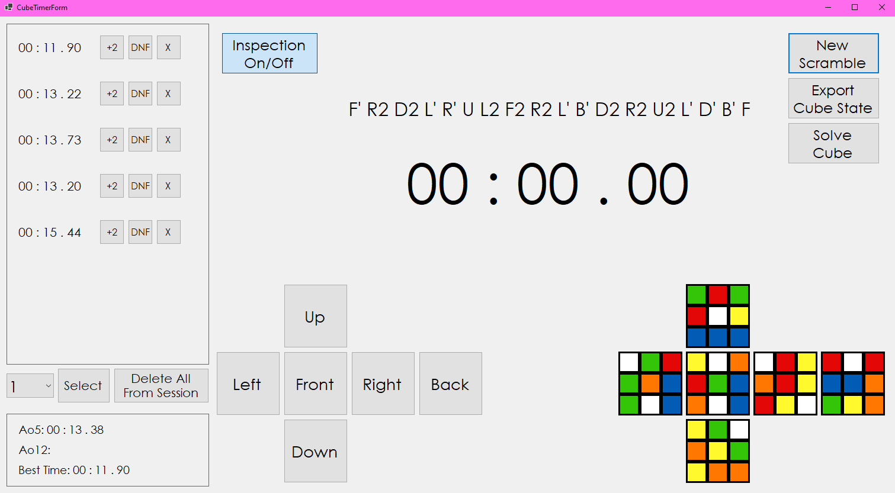

# LakaCubeTimer

Time your solves with generated WCA style scrambles, switch between sessions, +2, DNF or remove times, enable/disable inspection, live preview of the current scramble, see averages and best time, export the current cube state and scramble, and solve the cube using a python script with the kociemba library.

Technologies: C# winforms, MS Access database, python with kociemba for solving

