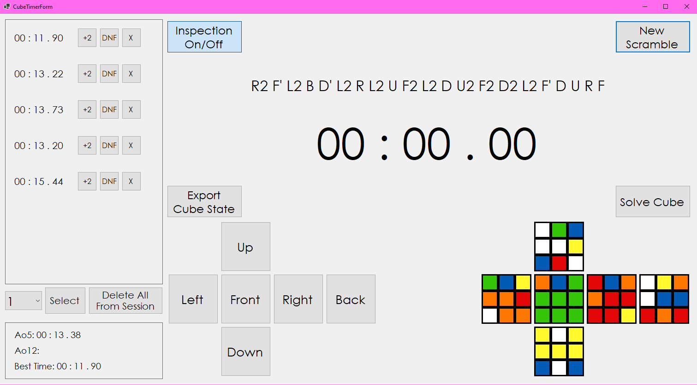

# LakaCubeTimer

Time your solves with generated WCA style scrambles, switch between sessions, +2, DNF or remove times, enable/disable inspection, live preview of the current scramble, see averages and best time, export the current cube state and scramble, and solve the cube using a Python script with the kociemba library.

Technologies: .NET CORE 6, C# Winforms, SQLite, Python 3 with kociemba for solving.

Instructions: You need .NET CORE 6 runtime to run the app and Python 3.x.x with the kociemba library in order for the cube solving to work. If you're cloning, then put the times.db and solve.py files in the appropriate locations for your configuration eg: bin/x64/Release/net6.0-windows10.0.22621.0.
Otherwise just download the latest release.

